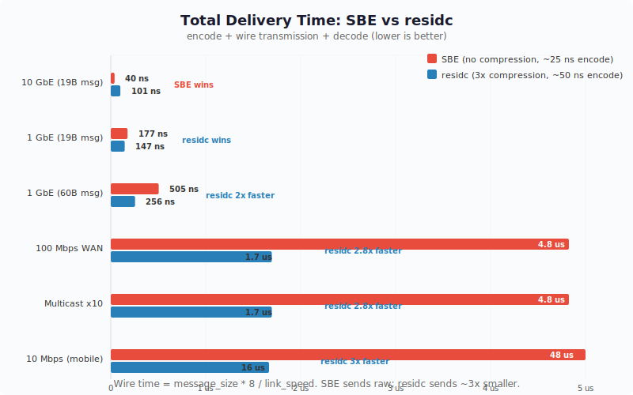

# residc

**Schema-driven, per-message prediction-residual compression for financial data.**

residc compresses financial messages (quotes, orders, trades) **2-3x** by predicting each field from context and encoding only the prediction error. Unlike general-purpose compressors (LZ4, zstd), it works on individual messages -- no blocks, no buffering, per-message random access.

Structure-agnostic: you define any message struct, map fields to prediction types, and the codec handles the rest.

## Benchmarks

### Compression

```
                Raw    Compressed   Ratio    Errors
Quotes        27.0 B   11.6 B     2.34:1      0     (100K synthetic quotes)
Orders        43.7 B   13.4 B     3.26:1      0     (2M synthetic order flow)
```

#### External Benchmarks (not reproducible from this repo)

```
                Raw    Compressed   Ratio    Errors
ITCH 5.0      32.2 B    9.9 B     3.27:1      0     (8M real NASDAQ messages)
```

### Latency

|  | C (gcc -O2, best of 10) | Rust (criterion mean, --release LTO) |
|--|--------------------------|--------------------------------------|
| Encode | **51 ns/msg** | **49 ns/msg** |
| Decode | 48 ns/msg | **42 ns/msg** |

Measured on 5-field synthetic quotes (100K messages). C uses `clock_gettime` best-of-10; Rust uses criterion statistical analysis (100 samples). Both compiled with `-march=native` / `target-cpu=native`.

## Comparison to Alternatives

### Per-message codecs (apples to apples)

| Codec | Ratio (ITCH) | Encode | Decode | Per-msg | Approach |
|-------|-------------|--------|--------|---------|----------|
| **residc** | **3.27:1** | **49 ns** | **42 ns** | Yes | Prediction-residual |
| SBE | 1.00:1 | ~25 ns | ~0 ns | Yes | Zero-copy struct overlay, no compression |
| rkyv | 1.00:1 | ~10 ns | ~0 ns | Yes | Zero-copy archived structs, no compression |
| Cap'n Proto | 1.00:1 | ~10 ns | ~0 ns | Yes | Zero-copy builder, no compression |
| FlatBuffers | 1.00:1 | ~15 ns | ~0 ns | Yes | Zero-copy + offset tables, no compression |
| FAST (FIX) | 2-4:1 | ~200 ns | ~200 ns | Yes | Template delta + stop-bit coding |
| Protobuf | ~1.3:1 | ~100 ns | ~80 ns | Yes | Varint, no cross-message state |
| LZ4 per-msg | 1.02:1 | ~50 ns | ~30 ns | Yes | Byte-sequence matching (too small) |

### Block codecs (different trade-off: no random access)

| Codec | Ratio (ITCH) | Per-msg | Notes |
|-------|-------------|---------|-------|
| LZ4 block (64KB) | 1.80:1 | No | Needs buffering |
| zstd block (64KB) | ~2.5:1 | No | Needs buffering |
| zstd (dict) | ~2.8:1 | No | Requires pre-trained dictionary |

### When to use what

| Scenario | Best choice | Why |
|----------|------------|-----|
| Same-rack ultra-low-latency (FPGA, kernel bypass) | SBE / rkyv / Cap'n Proto | ~10-25ns encode, bandwidth is free |
| WAN market data distribution | **residc** | 3x smaller = 3x more throughput, wire time dominates |
| Cloud / multi-region feeds | **residc** | Bandwidth costs money, latency budget is microseconds |
| Multicast to N consumers | **residc** | Compression paid once, wire savings multiplied N times |
| Historical data storage | **residc** + block compressor | Per-message access + block-level ratio |
| Cross-datacenter replication | **residc** | Every byte costs on leased lines |
| Mobile / retail data delivery | **residc** | 2-3x compression, lower bandwidth costs |

### Total delivery time: residc vs SBE

SBE is faster to encode but sends larger messages. The real metric is **end-to-end**: encode + wire + decode.



| Link | SBE total | residc total | Winner |
|------|----------|-------------|--------|
| 10 GbE, 19B msg | 25ns + 15ns = **40ns** | 49ns + 5ns + 42ns = **96ns** | SBE |
| 1 GbE, 19B msg | 25ns + 152ns = **177ns** | 49ns + 51ns + 42ns = **142ns** | **residc** |
| 1 GbE, 60B msg | 25ns + 480ns = **505ns** | 49ns + 160ns + 42ns = **251ns** | **residc** |
| 100 Mbps WAN | 25ns + 4.8us = **4.8us** | 49ns + 1.6us + 42ns = **1.7us** | **residc** |
| Multicast x10, 1GbE | 25ns + 10*480ns = **4.8us** | 49ns + 10*160ns + 42ns = **1.7us** | **residc** |

**The crossover point is ~1 GbE.** Above that, SBE wins on encode speed. Below that, residc wins because 3x smaller messages travel 3x faster on the wire. For data distribution — where vendors serve thousands of consumers over WAN, cloud, or multicast — the compression pays for itself many times over.

### vs FAST Protocol

FAST (FIX Adapted for STreaming) was the FIX Trading Community's answer to this exact problem. It used template-based delta encoding with stop-bit coding. residc differs in:

- **Prediction quality**: FAST uses simple delta. residc uses EMA (timestamps), MFU tables (instruments), per-instrument tracking (prices), regime detection (adaptive k). Better predictions = smaller residuals.
- **Coding efficiency**: FAST uses stop-bit coding (7 useful bits per byte). residc uses tiered variable-width codes at bit granularity. More compact for small values.
- **Simplicity**: residc is two C files (1,661 lines) or one Rust crate (1,194 lines excl. tests). FAST implementations are typically 10-50K lines.
- **Status**: FAST is being deprecated. CME discontinued FAST feeds in 2023. SBE replaced it for low-latency; residc fills the compression niche that FAST left behind.

## Implementations

> **Note:** The C and Rust implementations use different wire formats and are not interoperable. The C implementation is the canonical wire format, used by the SDK. See [Wire Format Specification](doc/WIRE_FORMAT.md).

| | C | Rust |
|--|---|------|
| Files | `core/residc.h` + `core/residc.c` | `rust/src/` (4 modules) |
| Lines | 1,661 | 1,591 (1,194 without tests) |
| Dependencies | 0 | 0 |
| `no_std` | N/A | Yes |
| Heap allocations | 0 | 0 |
| Encode latency | 51 ns | **49 ns** |
| Decode latency | 48 ns | **42 ns** |

## Quick Start (C)

```c
#include "residc.h"

typedef struct {
    uint64_t timestamp;
    uint16_t instrument_id;
    uint32_t price;
    uint32_t quantity;
    uint8_t  side;
} Quote;

static const residc_field_t fields[] = {
    { RESIDC_TIMESTAMP,  offsetof(Quote, timestamp),     8, -1 },
    { RESIDC_INSTRUMENT, offsetof(Quote, instrument_id), 2, -1 },
    { RESIDC_PRICE,      offsetof(Quote, price),         4, -1 },
    { RESIDC_QUANTITY,   offsetof(Quote, quantity),       4, -1 },
    { RESIDC_BOOL,       offsetof(Quote, side),           1, -1 },
};

static const residc_schema_t schema = {
    .fields = fields, .num_fields = 5, .msg_size = sizeof(Quote),
};

residc_state_t enc, dec;
residc_init(&enc, &schema);
residc_init(&dec, &schema);

Quote q = { .timestamp = 34200000000000, .instrument_id = 42,
            .price = 1500250, .quantity = 100, .side = 0 };

uint8_t buf[64];
int len = residc_encode(&enc, &q, buf, sizeof(buf));

Quote decoded;
residc_decode(&dec, buf, len, &decoded);
// decoded == q (bit-perfect)
```

## Quick Start (Rust)

```rust
use residc::{Schema, FieldType, Codec, Message};

let schema = Schema::builder()
    .field("timestamp", FieldType::Timestamp)
    .field("instrument", FieldType::Instrument)
    .field("price", FieldType::Price)
    .field("quantity", FieldType::Quantity)
    .field("side", FieldType::Bool)
    .build();

let mut enc = Codec::new(&schema);
let mut dec = Codec::new(&schema);

let msg = Message::new()
    .set(0, 34_200_000_000_000u64)
    .set(1, 42u64)
    .set(2, 1_500_250u64)
    .set(3, 100u64)
    .set(4, 0u64);

let mut buf = [0u8; 64];
let len = enc.encode(&msg, &mut buf).unwrap();
let decoded = dec.decode(&buf[..len]).unwrap();
assert_eq!(decoded.get(2), 1_500_250);
```

## Field Types

| Type | Prediction Strategy | Use for |
|------|-------------------|---------|
| `Timestamp` | EMA of inter-message gaps + adaptive k | Nanosecond timestamps |
| `Instrument` | MFU table (top 256 by frequency) | Security/instrument IDs |
| `Price` | Per-instrument last price + penny normalization | Fixed-point prices |
| `Quantity` | Per-instrument last qty + zero-residual flag + round-lot | Share/lot quantities |
| `SequentialId` | Delta from last (per-instrument or global) + adaptive k | Order IDs, execution IDs |
| `Enum` | Same-as-last flag | Side (B/S), order type, TIF |
| `Bool` | None (1 bit) | Flags |
| `Categorical` | Same-as-last flag | Account IDs, firm codes |
| `DeltaPrice` | Delta from a reference price field in same message | Ask price (delta from bid) |
| `DeltaId` | Delta from a reference ID field in same message | Original order ref |
| `Computed` | Not transmitted (0 bits on wire) | Derived fields (leaves_qty) |
| `Raw` | None (verbatim) | Unpredictable fields |

## How It Works

For each message:

1. **Predict** each field from synchronized encoder/decoder state
2. **Compute residual** = actual - predicted
3. **Zigzag encode** the signed residual to unsigned: `0 -> 0, -1 -> 1, 1 -> 2, -2 -> 3, ...`
4. **Tiered encode** the unsigned residual (parameterized by k):

```
Tier 0:  0                       value = 0               cost: 1 bit
Tier 1:  10  + k bits            values [1, 2^k]         cost: 2+k bits
Tier 2:  110 + 2k bits           next 2^(2k) values      cost: 3+2k bits
Tier 3:  1110 + 3k bits          next 2^(3k) values      cost: 4+3k bits
Tier 4:  11110 + 32 bits         any 32-bit value         cost: 37 bits
Tier 5:  11111 + 64 bits         any 64-bit value         cost: 69 bits
```

5. **Update state** identically on both encoder and decoder

The k parameter adapts to market regime (CALM vs VOLATILE), detected every 64 messages from average price residual magnitude.

Each compressed message is independently framed: `[1-byte length][payload]`. If compressed size >= raw size, a literal fallback frame (`0xFF` marker) is used, guaranteeing worst-case expansion of 1 byte.

## Cross-Machine Operation

Encoder and decoder run on different machines. They stay synchronized through identical state evolution -- both compute the same predictions from the same message stream. No shared memory, no coordination protocol. The wire carries only compressed frames.

## Gap Recovery (State Checkpoint)

If messages are lost in transit, encoder and decoder state diverges. To recover:

1. **Snapshot** decoder state periodically (e.g., every N messages)
2. **Detect** the gap (sequence number jump, transport-layer notification)
3. **Restore** the snapshot and **replay** from that point

```c
// C
residc_state_t checkpoint;
residc_snapshot(&decoder, &checkpoint);  // periodically

// ... gap detected ...
residc_restore(&decoder, &checkpoint);   // restore
// replay messages from checkpoint onwards
```

```rust
// Rust
let checkpoint = decoder.snapshot();     // periodically

// ... gap detected ...
decoder.restore_from(&checkpoint);       // restore
// replay messages from checkpoint onwards
```

The snapshot is a full copy of the codec state (~330KB). For most applications, snapshotting every 1000-10000 messages balances recovery speed vs memory overhead.

## MFU Pre-Seeding

By default, the MFU (Most-Frequently-Used) instrument table starts empty and learns from the message stream. If you know the instrument distribution ahead of time, pre-seed it for better compression from message 1:

```c
// C — seed with top instruments by frequency
uint16_t ids[]    = { 42, 99, 7, 101, 55 };
uint16_t counts[] = { 500, 300, 200, 150, 100 };
residc_mfu_seed(&encoder.mfu, ids, counts, 5);
residc_mfu_seed(&decoder.mfu, ids, counts, 5);  // must match
```

```rust
// Rust
let seed = [(42, 500), (99, 300), (7, 200), (101, 150), (55, 100)];
encoder.seed_mfu(&seed);
decoder.seed_mfu(&seed);  // must match
```

## SDK (C-based, cross-language)

The SDK wraps the C core into an opaque-handle API suitable for FFI bindings:

```bash
cd sdk
make              # builds libresdc.so and libresdc.a
```

### Python

```python
from residc import Codec, TIMESTAMP, INSTRUMENT, PRICE, QUANTITY, BOOL

enc = Codec([TIMESTAMP, INSTRUMENT, PRICE, QUANTITY, BOOL])
dec = Codec([TIMESTAMP, INSTRUMENT, PRICE, QUANTITY, BOOL])

data = enc.encode([34200000000000, 42, 1500250, 100, 0])
values = dec.decode(data)
assert values == [34200000000000, 42, 1500250, 100, 0]
```

The Python SDK uses ctypes with zero dependencies. See `sdk/python/example.py` for a complete example.

## Building

### C

```bash
# Two files, no dependencies
cc -O2 -o quote_example examples/custom/quote_example.c core/residc.c -Icore
./quote_example
```

### Rust

```bash
cd rust
cargo test     # 16 tests
cargo bench    # criterion benchmarks
```

## Technical Paper

See [doc/TECHNIQUE.md](doc/TECHNIQUE.md) for the full technical description: prediction strategies, tiered residual coding, adaptive k, regime detection, framing, and state synchronization.

## License

Licensed under either of

- Apache License, Version 2.0 ([LICENSE-APACHE](LICENSE-APACHE) or http://www.apache.org/licenses/LICENSE-2.0)
- MIT License ([LICENSE-MIT](LICENSE-MIT) or http://opensource.org/licenses/MIT)

at your option.
